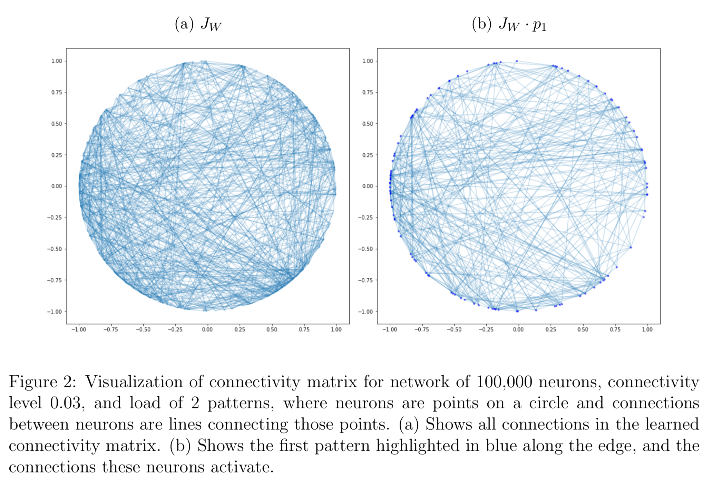

# Explaining and Exploring Pattern Completion

This repository contains Jupyter notebooks to recreate pattern completion simulations I have created, modeled after *Synaptic mechanisms of pattern completion in the hippocampal CA3 network* by Guzman, Schlogl, Frotscher, and Jonas (2016). Details can be found in the report I wrote to accompany these simulations: [pattern-completion.pdf]()

This work was done as the final project of the class [Computation and the Brain](https://computationandbrain.github.io/about/) taught by Professor Christos Papadimitriou in Fall 2018 in the Computer Science Department of Columbia University.



## Set Up

These simulations were developed in Python 3.6 and have the following dependencies:

```
numpy
scipy
matplotlib
```

Please let me know if you have any issues.